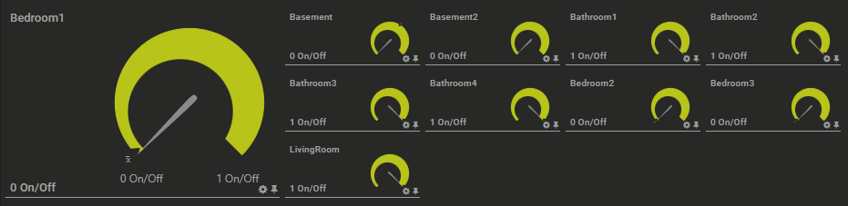
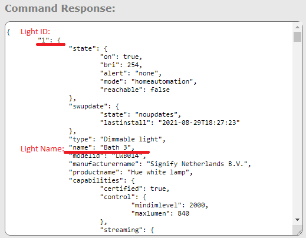
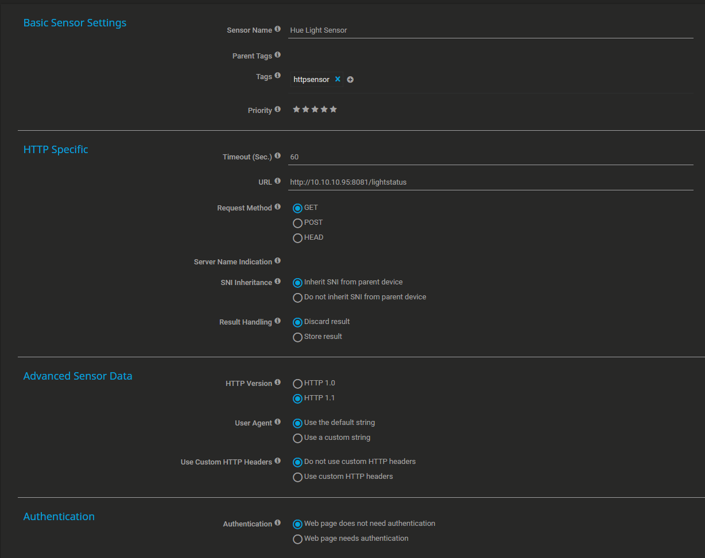

# **About**

PRTG Hue Lights Sensor is a Node App that will send sensor data for your Hue lights to a Custom HTTP Data Sensor created for PRTG Network Monitor.

# **Hue Lights PRTG Sensor**




## Requirements:

NodeJS, NPM, Hue Lights, and PRTG Network Monitor

# **Installation and Setup**

1. Installation of NodeJS: https://nodejs.org/en/

2. Installation of Node Package Manager:
```
npm install -g npm
```

3. To setup the project you will need to install the required node modules, from inside the project directory run:
```
npm install
```

4. To configure the sensor you will need a Hue Auth Token and your Hue Hub IP address. Visit https://developers.meethue.com/develop/get-started-2/ if you are unsure how to find these.

5. To find out what lights you have from the Hue Debugger Interface <http://"hue hub IP address"/debug/clip.html> use the "GET" function with the URL string:
```
/api/<"your hue auth token">/lights
```

It will return a JSON response with your LightIDs and Names. They go in the lightsArray variable



6. Depending on how many lights you have you will need to change the numberOfLights variable to the desired amount

7. To start the sensor run:
```
node app.js
```

8. Add the sensor to PRTG Network Monitor by searching for HTTP Data Advanced sensor.

9. Configure the HTTP Data Advanced Sensor by filling in the required information with IP and PORT (8081) the sensor app is running on



10. You should now have a sensor populate with values of 1 (On) or 0 (Off).


